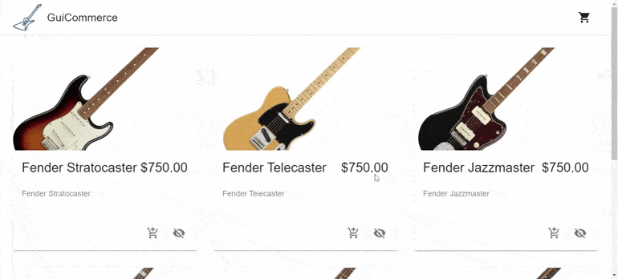

## Getting started

- Clone the repository

- Open a terminal and run `npm install` to install the dependencies used in this project

- Once the installation is finished run, in the same terminal, `npm start` to initialize the project

## Demo

